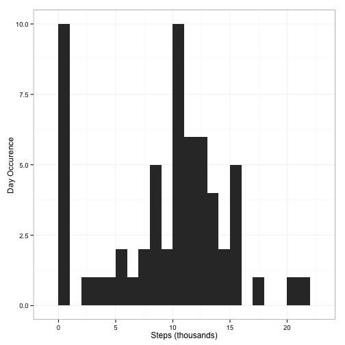
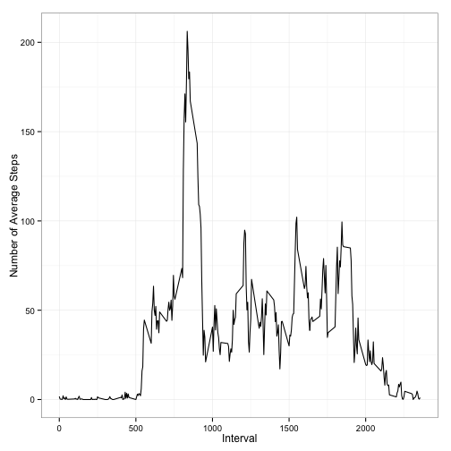
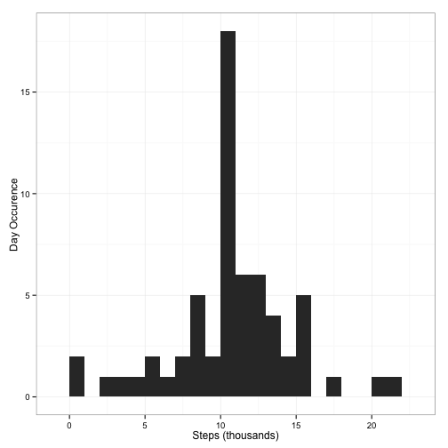
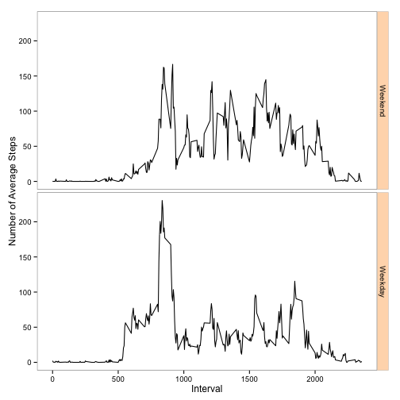

# Reproducible Research: Peer Assessment 1

## Load required packages

```r
require(dplyr)
require(ggplot2)
require(knitr)
```
  
    
## Set the global options  

```r
opts_chunk$set(echo = TRUE, results = 'asis')
options(scipen = 1)     # Turn off scientific notations for numbers
```


## Loading and preprocessing the data

```r
if(!file.exists("activity.csv"))
        unzip("activity.zip")

activityDF <- read.csv("activity.csv") %>%
        mutate(date = as.Date(date, "%Y-%m-%d"))
```


## Calculate mean total number of steps taken per day and draw the histogram

```r
stepsPerDay <- activityDF %>%
        group_by(date) %>%
        summarise(steps = sum(steps, na.rm = TRUE))

ggplot(stepsPerDay, aes(steps/1e3)) +
        geom_histogram(binwidth = 1) +
        theme_bw() +
        labs(x = "Steps (thousands)",
             y = "Day Occurence")
```

 

```r
summary <- summarise(stepsPerDay, stepsMean = mean(steps), stepsMedian = median(steps))
```
  

Mean steps taken per day = **9354.2295082**  
Median steps taken per day = **10395**  
  
  

## Calculate the average daily activity pattern

```r
stepsPerInt <- activityDF %>%
        group_by(interval) %>%
        summarise(steps = mean(steps, na.rm = TRUE))

ggplot(stepsPerInt, aes(interval, steps)) +
        geom_line() + 
        theme_bw() +
        labs(x = "Interval",
             y = "Number of Average Steps")
```

 

```r
maxStepsInterval <- stepsPerInt$interval[ which.max(stepsPerInt$steps) ]
```
  
Maximum number of steps in a 5-minute interval = **835**  
  
    
## Imputing missing values

```r
missingValues <- sum(is.na(activityDF$steps))
```
Number of missing values in the data set = **2304** 

We are going to impute these missing values using average steps by interval.


```r
imputedDF <- activityDF %>%
        left_join(stepsPerInt, by = "interval") %>%
        mutate(steps = ifelse(is.na(steps.x), steps.y, steps.x))
```


```r
imputedStepsByDay <- imputedDF %>%
        group_by(date) %>%
        summarise(steps = sum(steps))

ggplot(imputedStepsByDay, aes(steps/1e3)) +
        geom_histogram(binwidth = 1) +
        theme_bw() +
        labs(x = "Steps (thousands)",
             y = "Day Occurence")
```

 

```r
imputedSummary <- summarise(imputedStepsByDay, meanImpSteps = mean(steps), 
                            medianImpSteps = median(steps))
```
  
Mean imputed steps taken per day = **10766.1886792**  
Median imputed steps taken per day = **10766.1886792**
  
The histogram overall is very similar to the one we generated earlier, except that we have far less days falling into the zero steps bucket. This makes sense because we imputed `NA` with interval average, which shifted mean up quite a bit while kept median roughly the same.


## Differences in activity patterns between weekdays and weekends

```r
partitionedDF <- imputedDF %>%
        mutate(weekday = as.POSIXlt(date)$wday) %>%
        mutate(weekday = weekday > 0 & weekday < 6) %>%
        mutate(weekday = factor(weekday, labels = c("Weekend", "Weekday"))) %>%
        group_by(weekday, interval) %>%
        summarise(steps = mean(steps))

library(ggplot2)
ggplot(partitionedDF, aes(interval, steps)) +
        geom_line() +
        facet_grid(weekday ~ .) +
        theme_bw() +
        labs(x = "Interval",
             y = "Number of Average Steps") + 
        theme(strip.background = element_rect(fill = "peachpuff")) +
        theme(panel.grid.major = element_blank()) +
        theme(panel.grid.minor = element_blank())
```

 
